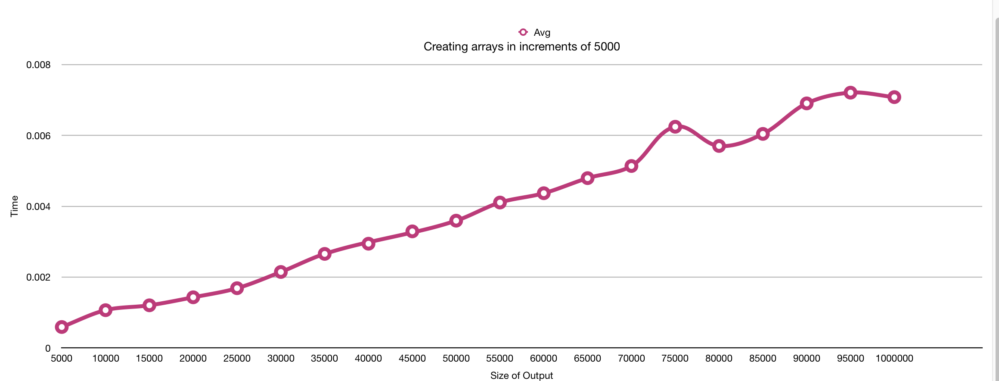

# Algorithmic-Complexity

## Algorithmic-Complexity

Algorithmic Complexity is the process of creating steps to make sure the code you have produced is the most efficent and clean code that you can write by reducing the number of steps in the Algorithm, establishing how much memory is taken up and how long it take to complete the number of operations

This can be demonstrated from the table below that has been created from a program, which created arrays in increments of 5000.  As the the arrays increase in size, so does the time taken to process the requests.

